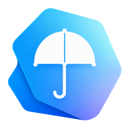

<div align="center">
  <br>
  

# Post Umbrella

A self-hosted, real-time collaborative API testing workspace for teams.<br>
Open-source alternative to **Postman** — running on **your** infrastructure, with AI agents built in.

[Get Started](https://post-umbrella.netlify.app/get-started) · [Website](https://post-umbrella.netlify.app) · [Download Desktop App](https://github.com/patrickxunuo/post-umbrella/releases/latest)


</div>

## Features

- **Full request builder** — every HTTP method, headers, JSON / raw / form-data bodies, query params, Bearer auth with collection-level inheritance
- **Variables everywhere** — environment + collection variables with `{{key}}` substitution across URLs, headers, body, and auth
- **Path variables** — Postman-style `:id` per-request, with inline editing and a hover popover
- **Scripts** — pre-request and post-response scripts with a Postman-compatible `pm.*` API
- **Workflow builder** — drag requests into reusable sequential flows with live reports and console
- **Cookie jar** — domain-keyed local cookie storage, captured from responses and sent automatically
- **Saved examples** — snapshot request/response pairs for docs and regression testing
- **Real-time collaboration** — live sync with presence avatars, powered by Supabase Realtime
- **Workspaces & roles** — organize collections, scope access per team (Admin / Developer / Reader)
- **Import / export** — Postman v2.1, OpenAPI / Swagger 3.x, Insomnia v4, cURL — round-trip safe
- **MCP server** — AI agents (Claude Code, Codex, …) hit your workspace via an OAuth-protected [Model Context Protocol server](mcp-server/)
- **Desktop app** — native Windows + macOS via [Tauri v2](src-tauri/), with auto-updates
- **Dark / light theme** — theme-aware syntax highlighting and one-click toggle

## Getting started

The full setup walkthrough — Supabase deployment, frontend hosting, MCP server, and desktop builds — lives here:

**[post-umbrella.netlify.app/get-started](https://post-umbrella.netlify.app/get-started)**

> [!NOTE]
> Post Umbrella is designed to run entirely on the Supabase free tier — no custom server to maintain.

### Local development

```bash
npm install
npm run dev          # web app on http://localhost:5173
npm run tauri:dev    # desktop app (requires Rust)
```

Create a `.env` file with your Supabase project credentials first (see the [get-started guide](https://post-umbrella.netlify.app/get-started)).

### Desktop app

Grab the latest installer for Windows (`.msi`) or macOS (`.dmg`) from the [releases page](https://github.com/patrickxunuo/post-umbrella/releases/latest), or build it yourself:

```bash
npm run tauri:build
```

### Testing

```bash
npm run test:unit    # Vitest unit tests
npm run test:e2e     # Playwright E2E tests (requires a running backend)
```

## Tech stack

| Layer    | Technology                                               |
|----------|----------------------------------------------------------|
| Frontend | React 18 · Vite · Zustand · CodeMirror · Lucide          |
| Backend  | Supabase (PostgreSQL · Auth · Edge Functions · Realtime) |
| Desktop  | Tauri v2 (Rust)                                          |
| MCP      | Node.js · TypeScript · OAuth 2.0                         |

## Project structure

```
post-umbrella/
├── src/             # Frontend (React + Vite)
├── supabase/        # Migrations + Edge Functions
├── src-tauri/       # Desktop app (Tauri / Rust)
├── mcp-server/      # MCP server (Node.js / TypeScript)
├── website/         # Landing page
└── e2e/             # Playwright E2E tests
```

## Acknowledgments

Inspired by [Postman](https://postman.com). Built on [Supabase](https://supabase.com). Icons by [Lucide](https://lucide.dev).
